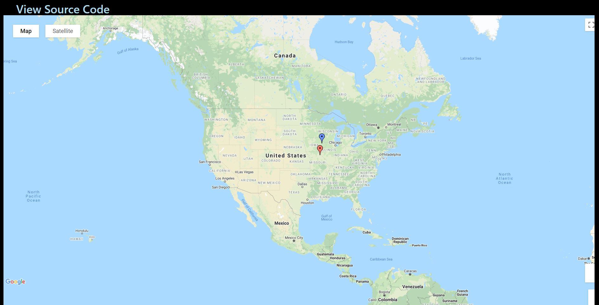

**RUN**
```bash
parcel index.html
```



# Notes
**Classes**
* Map.ts
* User.ts
* Company.ts

Any file used to create a class will have a capital name
Map.ts, User.ts, Company.ts

While any functional files will start lowercase

The !DOCTYPE added to HTML by emmet ```! + ENTER``` seems to not work with Google Maps

**Important**
Typical Typescript File:

|Interface                                         | Class Definitions  |
|--------------------------------------------------|--------------------|
| Definitions for working with this class          | What is the class  |
| Top 20%                                          | Bottom 80%         |


Adding on 'impliments' as in
```typescript
// CustomMaps.ts
export interface Mappable {
  location: {
    lat: number;
    lng: number;
  }
  markerContent(): string;
  color: string;
}

// Company.ts
export class Company implements Mappable {
  companyName: string;
  catchPhrase: string;
  location: {
    lat: number;
    lng: number;
  }
  color: string = 'red';
  ...
```
will add better TS documentation to assist with errors and props